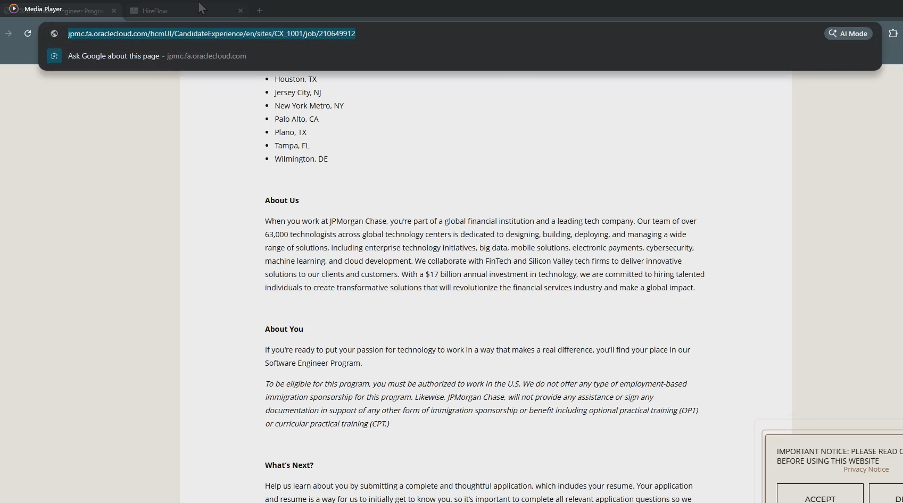
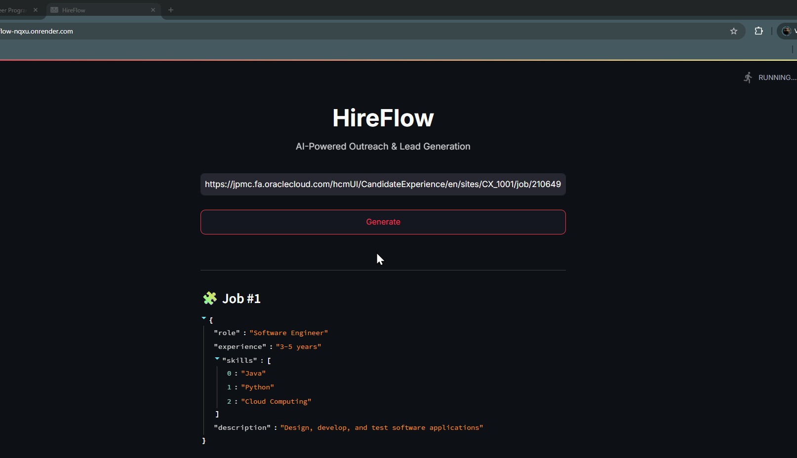
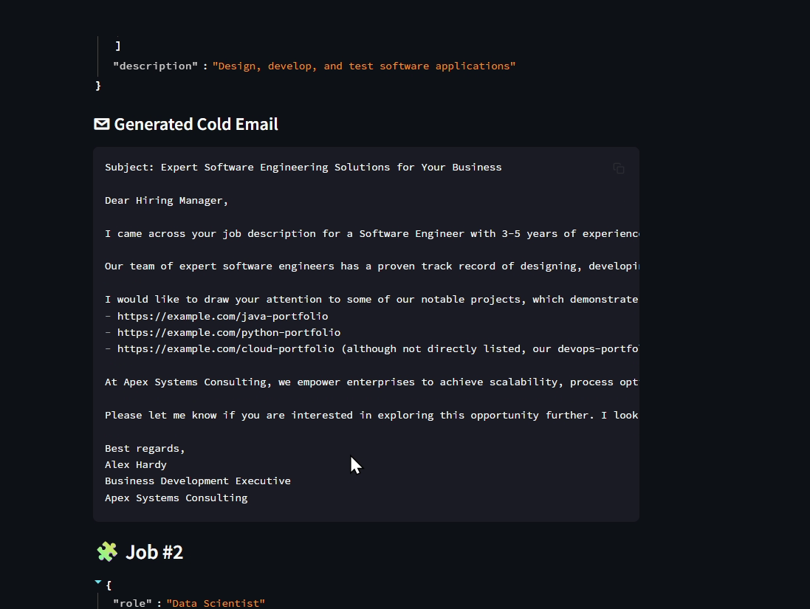
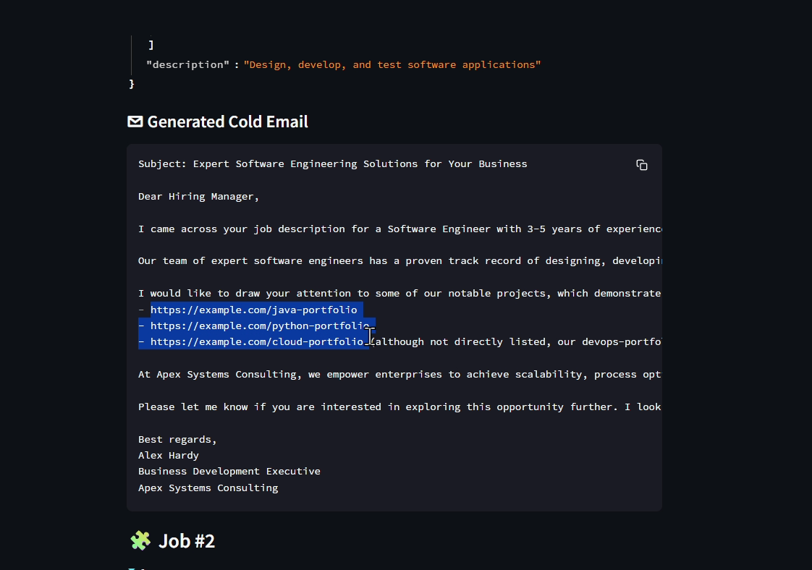

# 🚀 HireFlow – AI-Powered Outreach Automation Platform

### AI-Powered Job Outreach using RAG, LangChain, ChromaDB & Groq Llama 3.3

Automatically extract job requirements from career pages, match relevant portfolio projects, and generate personalized cold emails in seconds.


## 📸 Application Preview

### 🏠 Home Page

<p align="center">
  
</p>

The user simply enters a careers page URL and initiates the automated outreach generation process.

---

### 🔍 Job Requirement Extraction

<p align="center">
  
</p>

HireFlow scrapes the careers page and uses Groq Llama 3.3 to extract:
- Job Role
- Required Experience
- Technical Skills
- Job Description

---

### 📧 AI Generated Cold Email

<p align="center">
  
</p>

Using Retrieval-Augmented Generation (RAG), the platform retrieves relevant portfolio projects and generates personalized cold emails tailored to the job requirements.

---

### ⚙️ End-to-End Workflow

<p align="center">
  
</p>

# 🏗️ Architecture

```text
Career Page URL
       │
       ▼
WebBaseLoader
(Web Scraping)
       │
       ▼
Text Cleaning
       │
       ▼
Groq Llama 3.3
(Job Extraction)
       │
       ▼
Skill Extraction
       │
       ▼
ChromaDB
(Vector Database)
       │
       ▼
Semantic Search
       │
       ▼
Relevant Portfolio Projects
       │
       ▼
RAG Pipeline
       │
       ▼
Groq Llama 3.3
(Email Generation)
       │
       ▼
Personalized Cold Email
```

---

## ⚙️ Execution Flow

### Step 1: Career Page Input

User enters a company career page URL.

### Step 2: Web Scraping

LangChain WebBaseLoader extracts webpage content.

### Step 3: Data Cleaning

The content is cleaned and normalized for LLM processing.

### Step 4: Job Extraction

Groq Llama 3.3 extracts:

- Role
- Skills
- Experience
- Description

### Step 5: Portfolio Retrieval

ChromaDB performs semantic similarity search against portfolio projects.

### Step 6: RAG Augmentation

Relevant projects are injected into the LLM context.

### Step 7: Cold Email Generation

The LLM creates a personalized outreach email.

### Step 8: Output Delivery

The generated email is displayed instantly in the Streamlit application.

---

## ✨ Features

### 🔍 Automated Job Extraction

- Career page scraping
- Multi-job detection
- Structured JSON output

### 🧠 Retrieval-Augmented Generation (RAG)

- Context-aware responses
- Portfolio-aware personalization
- Semantic retrieval

### 📧 AI-Powered Email Generation

- Personalized outreach
- Professional formatting
- Ready-to-send output

### ⚡ Smart Portfolio Matching

- ChromaDB vector search
- Embedding-based retrieval
- Skill-aware recommendations

### 🌐 Interactive UI

- Streamlit application
- One-click generation
- Real-time results

---

## 🛠️ Tech Stack

### AI & LLM

- Groq Llama 3.3 70B
- LangChain
- Retrieval-Augmented Generation (RAG)

### Vector Database

- ChromaDB

### Backend

- Python

### Frontend

- Streamlit

### Data Processing

- Pandas
- NumPy

### Web Scraping

- WebBaseLoader
- BeautifulSoup

### Deployment

- Render
- GitHub

---

## 📂 Project Structure

```text
HireFlow/
│
├── main.py
├── chains.py
├── portfolio.py
├── utils.py
├── my_portfolio.csv
├── requirements.txt
├── runtime.txt
├── .env
├── vectorstore/
└── assets/
```

---

## 🚀 Installation

### Clone Repository

```bash
git clone https://github.com/yourusername/HireFlow.git

cd HireFlow
```

### Create Virtual Environment

```bash
python -m venv venv
```

### Activate Environment

```bash
# Windows
venv\Scripts\activate

# Linux / Mac
source venv/bin/activate
```

### Install Dependencies

```bash
pip install -r requirements.txt
```

### Configure Environment Variables

```env
GROQ_API_KEY=your_groq_api_key
```

### Run Application

```bash
streamlit run main.py
```

---

## 🎯 Use Cases

- Job Application Automation
- Freelance Outreach
- Lead Generation
- Consulting Proposals
- Recruitment Automation

---

## 📈 Key Outcomes

✅ Automated Job Requirement Extraction

✅ Semantic Portfolio Matching

✅ Personalized Cold Email Generation

✅ Reduced Manual Outreach Time

✅ End-to-End RAG Implementation

✅ Real-World LLM Application

---

## 🔮 Future Enhancements

- Multi-LLM Support
- LinkedIn Integration
- ATS Resume Analysis
- Auto Email Sending
- Job Recommendation Engine
- Agentic AI Workflow

---


**Interests**

- Generative AI
- Agentic AI
- LLM Engineering
- Machine Learning
- Data Science

---

⭐ If you found this project useful, please consider giving it a star.

